<div align="center">



**An interactive experiment space for half-baked ideas, tiny tools and web toys.**


### [🚀 Launch the live interactive site](https://jswnth-lab.github.io/jswnth-lab/)
*particles that follow your mouse · a working terminal · Konami code*

</div>

---

## 🧭 Pick your adventure

<details>
<summary><b>🧪 What is this place?</b> (click me)</summary>

<br>

jswnth lab is my sandbox. Things start here as a weekend idea and either grow into something real or get quietly archived. Expect rough edges.

</details>

<details>
<summary><b>⚡ What's in the lab?</b></summary>

<br>

| | Project | Vibe |
|---|---|---|
| 🧪 | **Experiments** | half-baked ideas that might become something |
| ⚡ | **Quick tools** | small utilities for very specific itches |
| 🎨 | **Visuals** | generative art, shaders, pretty distractions |
| 🤖 | **AI playground** | prompts, agents, things that talk back |
| 🌐 | **Web toys** | interactive pages that exist just for fun |

</details>

<details>
<summary><b>🕹️ Secrets</b></summary>

<br>

Open the [live site](https://jswnth-lab.github.io/jswnth-lab/) and try:

- Move your mouse. Hold click to repel.
- Type `help` in the terminal.
- Press <kbd>↑</kbd><kbd>↑</kbd><kbd>↓</kbd><kbd>↓</kbd><kbd>←</kbd><kbd>→</kbd><kbd>←</kbd><kbd>→</kbd><kbd>B</kbd><kbd>A</kbd>

</details>

<details>
<summary><b>🛠️ Run it locally</b></summary>

<br>

```bash
git clone https://github.com/jswnth-lab/jswnth-lab
cd jswnth-lab && open index.html   # no build step
```

</details>

---

<div align="center">


</div>
